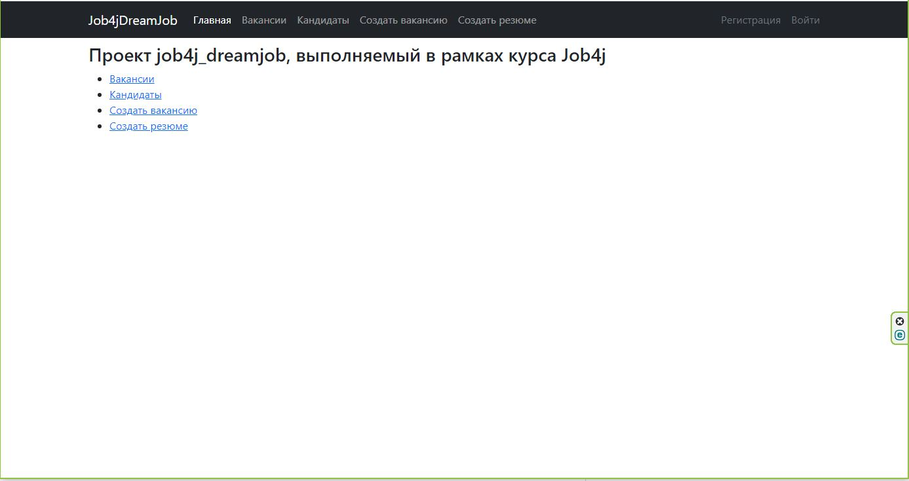
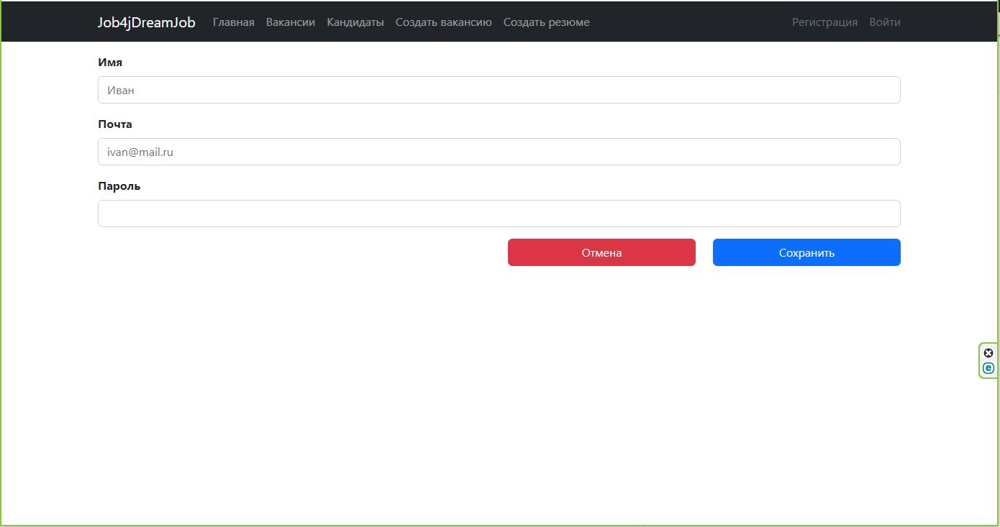
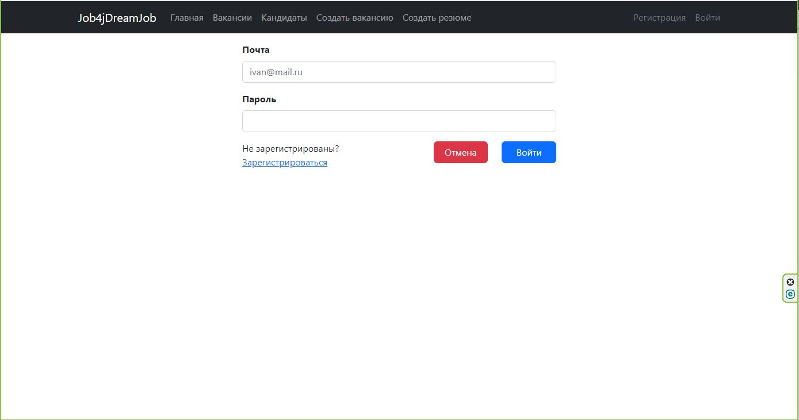
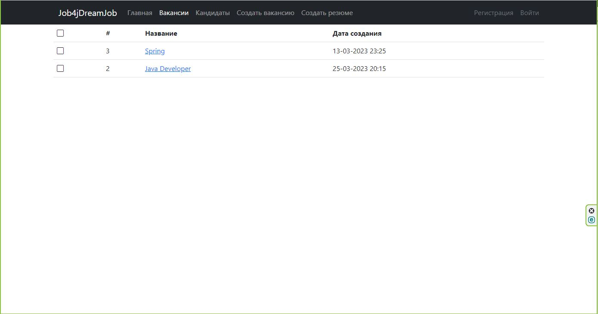
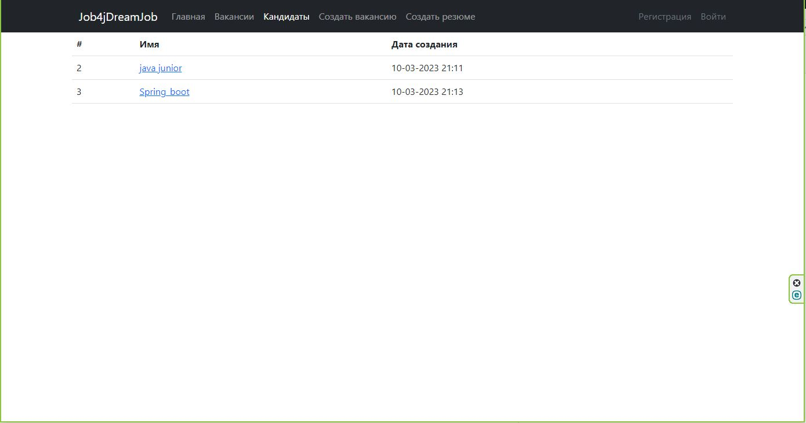
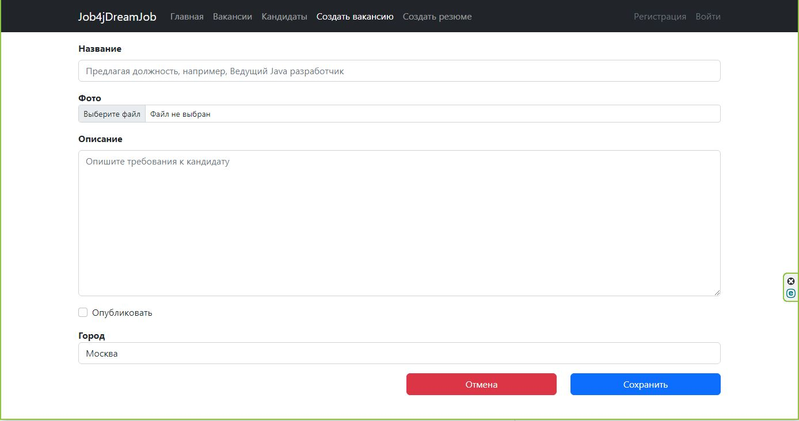
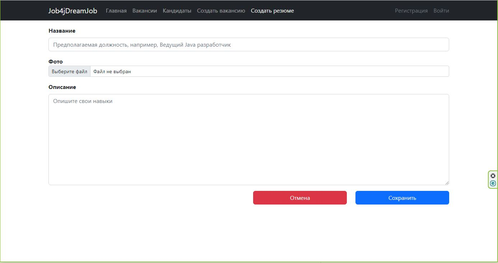
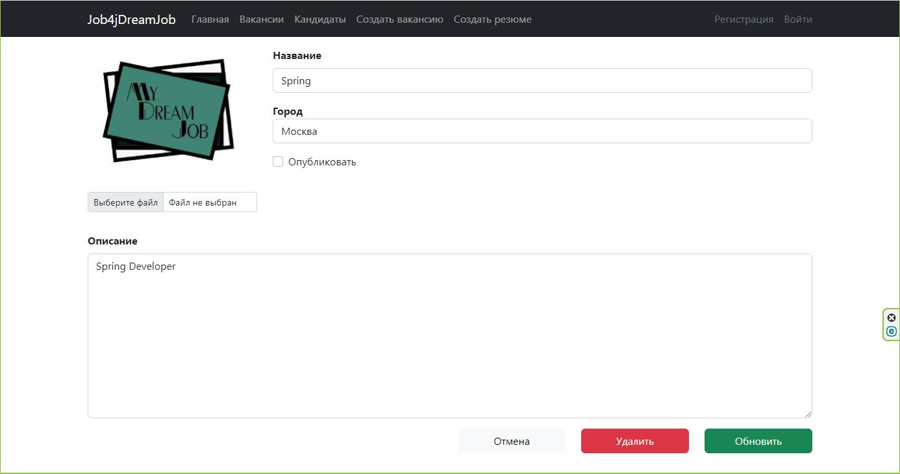
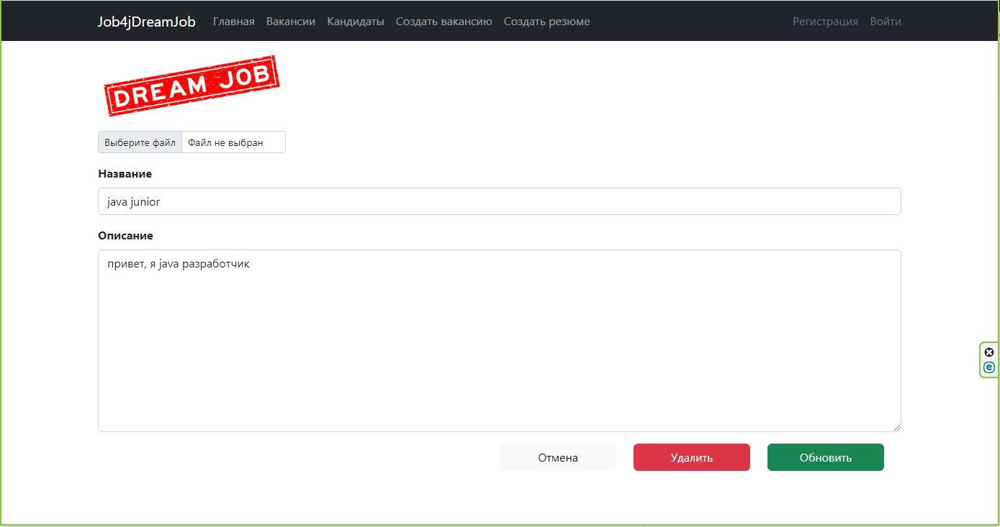

## job4j_dreamJob


Приложение представляет сайт для размещения вакансий.
### Основные возможности сайта
На сайте размещаются объявления о вакансиях, кадровики публикуют вакансии,
кандидаты публикуют резюме.
Объявление состоит из:

- названия вакансии/резюме
- описания вакансии/резюме
- даты публикации
- фотографии

___
### Стек технологий
- Java 17
- Spring boot
- Maven 3.8
- Thymeleaf
- Liquibase 4.15
- Junit 5
- Postgres 14
___
### Требования к окружению
- Java 17
- Maven 3.8
- Postgres 14
___
### Запуск проекта

Для запуска приложения необходима база данных
(команда ниже создает базу данных с названием dreamjob)
```
create database dreamjob
```
#### Варианты запуска приложения

С использованием командной строки и параметрами по умолчанию
(db=dreamjob, user=postgres, password=password, port=8081)
```
mvn spring-boot:run
```
С использованием собственных настроек базы данных и порта
```
mvn spring-boot:run -Dspring-boot.run.arguments=--db=your_database,--user=your_user,--password=your_password,--port=your_port
 ```

Компиляция в jar файл
```
mvn install
```
Запуск jar файла с параметрами по умолчанию
(db=dreamjob, user=postgres, password=password, port=8081)
```
java -jar target/job4j-dreamjob-1.0-SNAPSHOT.jar
```
Запуска jar файла с использованием собственных настроек базы данных и порта
```
java -jar target/job4j-dreamjob-1.0-SNAPSHOT.jar --db=your_database,--user=your_user,--password=your_password,--port=your_port
```

___
### Скриншоты приложения
    Главная страница

_________________________________

    Страница регистрации

_________________________________

    Страница входа

_________________________________

    Страница с вакансиями

_________________________________

    Страница с кандидатами

_________________________________

    Страница создания вакансии

_________________________________

    Страница создания резюме

_________________________________

    Страница редактирования вакансии

_________________________________

    Страница редактирования резюме

_________________________________

___
### Контакты

[GitHub.com](https://github.com/vnovopashin)